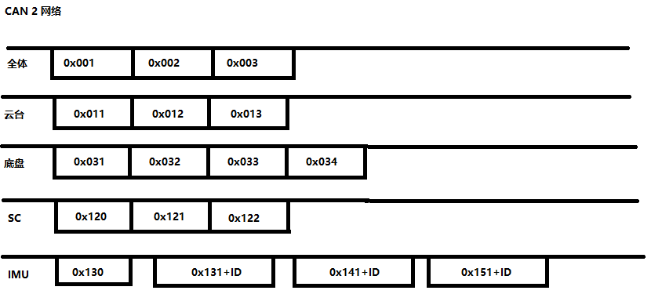
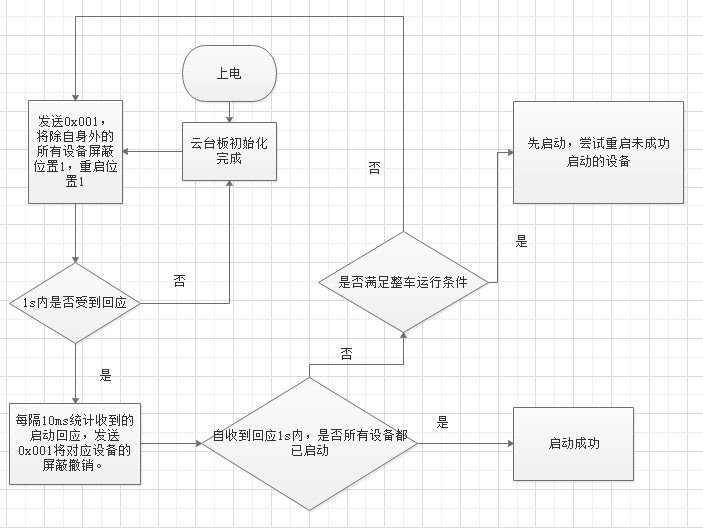
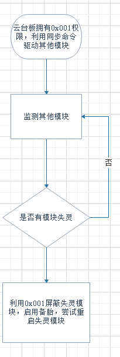
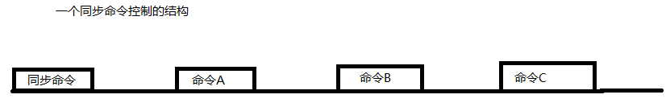
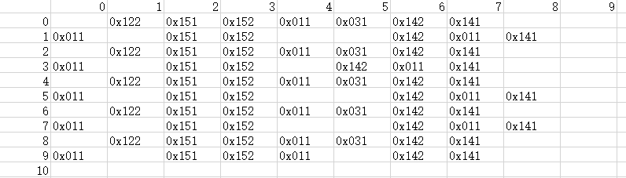

# ARTINX CAN网络协议

编写者：袁雨航

编写版本： beta 0.0

编写日期：2019/11/4

## 0 前言
新赛季本队机器人采用了分布式的嵌入式系统，各个模块之间需要基于可靠的通讯方式，使用自定通讯协议进行高速低时延通讯。

在比较SPI,USART,CAN等协议的特点后，我们决定使用CAN，因为它可靠性最高，拓展性很强。而针对CAN的通讯特点，我们初步设计了一台针对云台板+底盘板+超级电容板+IMU板的通讯协议。

## 1 总设定

1.云台板与底盘板分别通过CAN1控制各种的电机

2.云台板与底盘板，IMU模块等在同一CAN2网络中

3.CAN1网络遵循大疆产品说明书中的协议设定，不添加自主模块

4.CAN2网络遵循自定协议，均为自主模块

5.暂时只针对步兵

## 2. 图示

虽然由于CAN协议的特点，想要知道信息的发送者和接收者是不可能且没有实际意义的。但是对帧ID的归属做界定，可以使大家理解整个网络更加清晰明了，也更容易写代码。

## 3.要求与说明

读者极有可能无法理解为什么这个系统需要什么样的设计，当看到协议中详细的细节时会陷入迷茫，因此我们对系统的要求做进一步的说明。

1.系统要能识别任何部分的离线或失控，并快速进入应急方案。

2.系统中传输的数据须简单直接。

## 4.CAN配置
波特率 1Mbit/s,暂时都不使用过滤器。

## 5.接口协议说明

|StdID | DLC |Freq(括号内为转化为DLC=8时的等效频率)|Mean|
|:------:|:----:|:----:|:------|
|0x001|2|需要时|屏蔽与复位设备|
|0x002|1|1KHz(611Hz)|同步时钟|
|0x003|2|10Hz(7Hz)|云台报告自身CAN1网络设备在线情况|
|0x004|2|10Hz(7Hz)|底盘报告自身CAN1网络设备在线情况|
|0x011|8|150Hz (ch1)|底盘控制（纯遥控器模式）|
|0x012|8|150Hz (ch1)|底盘控制（纯键盘模式）|
|0x013|8|150Hz (ch1)|底盘控制（混合模式）|
|0x031|8|50Hz|17mm发射机构信息（缓冲，冷却速率，加点，射速）|
|0x032|8|100Hz (ch2)|云台反导绝对姿态（Yaw，Pitch）|
|0x120|2|需要时|超级电容工作情况|
|0x121|8|1kHz|实时功率，输入电压|
|0x122|6|50Hz(44Hz)|电容电压，充电速度，放电速度|
|0x130|3|需要时|IMU板ID，工作情况，量程与频率约定|
|0x131+ID|6|500Hz(450Hz)|姿态角信息|
|0x141+ID|6|100Hz(90Hz)|角速度信息|
|0x151+ID|6|100Hz(90Hz)|加速度信息|

频率计算说明：
      
DBUS每14ms发送一次数据，频率为71.42Hz，所以底盘控制设定为150Hz。

雷达站应该是使用裁判系统的串口进行数据传递，已知裁判系统串口频率最高的信息为50Hz,机器人交换数据上限10Hz。虽然我认为10Hz不足以反导，但是应该也不会超过100Hz。暂时设定为100Hz。

MP6050更新频率最高1000Hz，暂时取500Hz.

超级电容使用霍尔效应的电流计，采样频率取决于ADC频率，其远大于1kHz, 取1kHz。

CAN 在1Mbits/s的波特率下最大带宽为6950帧/s。负载越大，低优先级帧的实时性越差。当负载率达到60%的情况下，优先级最高的节点都有至少25%的延时，优先级最低的延时达到了4倍。

以2块IMU计，现有负载为45%。通过同步命令，可以达到发一帧等一帧的效果，即无视优先级同等低延时。

## 6.逻辑说明

### 6.1 屏蔽与复位命令（0x001）的逻辑

屏蔽与复位命令为权限与优先级最高的命令，在网络中只能有一个节点有发送的权限，权限的移交顺位为：云台板->底盘板。

每个节点在该命令中由2bits控制，屏蔽位与重启位。

当除发送者之外的任意节点接收到此命令后，应做出以下反应

1. 自身屏蔽位被置1：停止发送信息
2. 自身屏蔽位被置0：开始发送信息
3. 其他设备屏蔽位被置1：无视接收到的该设备信息。
4. 其他设备屏蔽位被置0：使用接收到的该设备信息。
5. 在自身屏蔽位被置1的前提下（可以不在同一帧中发生），自身重启位被置1： 尝试重启设备，重启成功后 发送相应回应，撤销屏蔽。
   
其余的情况为未定义的行为，任何节点都不反应。

### 6.2 初始化的描述

云台板启动流程图

### 6.3 快速切换

系统设计成这个样子，是为了当某个模块失灵时，可以直接切换备胎且备胎不需要等待初始化，即热备冗余。

具体做法如下

理论上只要发送一次0x001命令就能完成屏蔽，切换，重启的操作。

### 6.4 同步时序说明

CAN总线的特点是没有直接的带宽分配，实际上到底发送了什么数据和从发送到接收的延迟是不完全可控的。为了保证数据的稳定性与低延时，使用特点命令控制所有节点的发送节拍。也可以理解为将几种ID的命令整合为一个巨帧，其中的时间间隔由各自节点接收到同步命令后，通过各自的Timer控制。

    命令A的集合={0x121} 1000Hz级别 Sum=1000Hz

    命令B的集合={0x131+ID*2，}  500Hz级别 Sum=1000Hz

    命令C的集合={0x003，0x004，0x011 or 0x012 or 0x013,0x031,0x032(暂时没有),0x122，0x141+ID*2，0x151+ID*2} Sum=670Hz

简单的说就是，命令A每次都是0x121,命令B在两个IMU的0x131+ID之间切换。

命令C的描述用列表表示

|StdID | 每100个的出现次数|
|:------:|:----:
|0x003|1|
|0x004|1|
|0x011|15|
|0x031|5|
|0x122|5|
|0x141+ID|10|
|0x141+ID+1|10|
|0x151+ID|10|
|0x151+ID+1|10|
|NULL|33|

现有时序图

实际逻辑等待进一步完善

